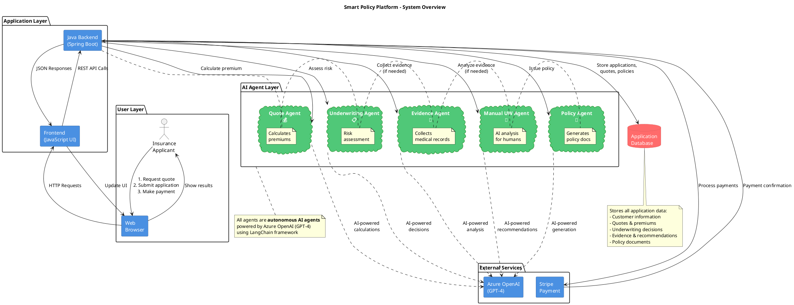
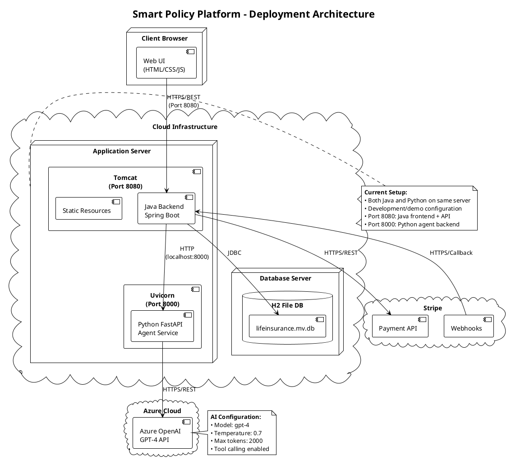

# Smart Policy Platform - Architecture Diagrams

This document contains multiple views of the system architecture, designed for different audiences.

## Table of Contents
1. [High-Level System Architecture](#1-high-level-system-architecture) - For executives and non-technical stakeholders
2. [Agent Decision Flow](#2-agent-decision-flow) - For business analysts and product managers
3. [Component Architecture](#3-component-architecture) - For technical teams
4. [Data Flow Diagram](#4-data-flow-diagram) - For integration and data teams

---

## 1. High-Level System Architecture
**Audience:** Business executives, product managers, non-technical stakeholders



**Key Points for Non-Technical Audience:**
- **User starts in web browser**: Simple interface for quotes and applications
- **5 AI Agents work autonomously**: Each agent is a specialized AI that handles specific tasks
- **Not all agents run every time**: System intelligently decides which agents are needed
- **Azure OpenAI provides intelligence**: All agents use GPT-4 for decision-making
- **Stripe handles payments**: Secure, PCI-compliant payment processing

---

## 2. Agent Decision Flow
**Audience:** Product managers, business analysts, operations team

```plantuml
@startuml Agent Decision Flow

!theme vibrant

title Smart Policy Platform - Agent Invocation Decision Flow

start

:Customer enters details
(Age, Coverage, Health);

:🤖 **QUOTE AGENT**
**Always Runs**;

note right
Calculates premium using
actuarial tables and AI
end note

:Calculate monthly premium;

if (Customer accepts quote?) then (Yes)
    
    :Customer submits application;
    
    :🤖 **UNDERWRITING AGENT**
    **Always Runs**;
    
    note right
    Rules Engine checks:
    • Age threshold
    • Coverage amount
    • Medical conditions
    end note
    
    if (Risk Assessment Result?) then (Low Risk\n✅ APPROVED)
        
        #LightGreen:Application approved
        instantly;
        
        :Customer makes payment;
        
        :💳 Stripe processes payment;
        
        if (Payment successful?) then (Yes)
            
            :🤖 **POLICY AGENT**
            **Conditional**;
            
            note right
            Generates policy document
            with terms and conditions
            end note
            
            #LightGreen:Policy issued
            Customer receives PDF;
            
            stop
            
        else (No)
            #Pink:Payment failed;
            :Retry payment or cancel;
            stop
        endif
        
    else (High Risk\n⚠️ MANUAL REVIEW NEEDED)
        
        #LightYellow:Application flagged
        for manual review;
        
        :🤖 **EVIDENCE AGENT**
        **Conditional**;
        
        note right
        Collects additional information:
        • Medical records (APS)
        • Financial documents
        • Physician reports
        **(5-second simulation)**
        end note
        
        :Gather medical records
        and evidence (5 seconds);
        
        :🤖 **MANUAL UNDERWRITING AGENT**
        **Conditional**;
        
        note right
        AI analyzes evidence and provides:
        • Key findings
        • Risk rating
        • Recommendation for human
        end note
        
        :AI analyzes evidence
        Provides recommendation;
        
        #LightBlue:👤 **HUMAN UNDERWRITER**
        Reviews AI recommendation;
        
        note right
        Human reviews:
        • Customer details
        • Evidence summary
        • AI recommendation
        • Risk assessment
        end note
        
        if (Human Decision?) then (Approve)
            #LightGreen:Application approved
            by human;
            :Customer makes payment;
            :Process payment;
            :Issue policy;
            stop
        else (Reject)
            #Pink:Application rejected;
            :Send rejection notice
            with reason;
            stop
        endif
        
    else (Very High Risk\n❌ REJECTED)
        #Pink:Application rejected
        automatically;
        :Send rejection notice;
        stop
    endif
    
else (No)
    :Customer leaves;
    stop
endif

legend right
|= Symbol |= Meaning |
| 🤖 | AI Agent |
| 👤 | Human Decision |
| ✅ | Approved |
| ❌ | Rejected |
| ⚠️ | Needs Review |
| 💳 | Payment |
endlegend

@enduml
```

**Agent Invocation Summary:**

| Agent | When It Runs | Purpose | Typical Duration |
|-------|-------------|---------|------------------|
| **Quote Agent** 💰 | ✅ Always | Calculate premium | 2-3 seconds |
| **Underwriting Agent** 📋 | ✅ Always | Assess risk, decide path | 3-5 seconds |
| **Evidence Agent** 📄 | ⚠️ Only if high risk | Collect medical records | 5 seconds |
| **Manual UW Agent** 🤖 | ⚠️ Only after evidence | AI analysis for human | 5-10 seconds |
| **Policy Agent** 📜 | ✅ After payment | Generate policy document | 5-10 seconds |

---

## 3. Component Architecture
**Audience:** Software engineers, architects, technical leads

```plantuml
@startuml Component Architecture

!theme aws-orange

title Smart Policy Platform - Technical Component Architecture

package "Frontend Tier (Port 8080)" {
    [index.html] as HTML
    [app.js] as JS
    [style.css] as CSS
    
    HTML --> JS
    HTML --> CSS
}

package "Java Backend Tier (Port 8080)" {
    
    package "Controllers" {
        [QuoteController] as QC
        [ApplicationController] as AC
        [PolicyController] as PC
    }
    
    package "Services" {
        [QuoteAgentService] as QS
        [UnderwritingAgentService] as US
        [EvidenceAgentService] as ES
        [ManualUnderwritingAgentService] as MS
        [PolicyIssuanceAgentService] as PS
        [StripePaymentService] as SPS
    }
    
    package "Models (JPA Entities)" {
        [InsuranceQuote] as IQ
        [InsuranceApplication] as IA
        [InsurancePolicy] as IP
    }
    
    package "Repositories" {
        [InsuranceQuoteRepository] as IQR
        [InsuranceApplicationRepository] as IAR
        [InsurancePolicyRepository] as IPR
    }
    
    ' Controller connections
    QC --> QS
    AC --> US
    AC --> SPS
    PC --> PS
    
    ' Service connections
    US --> ES: if manual review
    US --> MS: if manual review
    QS --> IQR
    US --> IAR
    ES --> IAR
    MS --> IAR
    PS --> IPR
    SPS --> IAR
    
    ' Repository to Models
    IQR --> IQ
    IAR --> IA
    IPR --> IP
}

package "Python Agent Tier (Port 8000 - FastAPI)" {
    
    package "API Endpoints" {
        [/agent/quote] as EP1
        [/agent/underwrite] as EP2
        [/agent/request-evidence] as EP3
        [/agent/manual-underwrite] as EP4
        [/agent/issue-policy] as EP5
    }
    
    package "Agents (LangChain)" {
        [QuoteAgent] as PA1
        [UnderwritingAgent] as PA2
        [EvidenceAgent] as PA3
        [ManualUnderwritingAgent] as PA4
        [PolicyIssuanceAgent] as PA5
    }
    
    package "Agent Tools" {
        [calculate_premium] as T1
        [assess_risk_factors] as T2
        [aps_request_tool] as T3
        [medical_records_tool] as T4
        [evidence_analysis_tool] as T5
        [risk_assessment_tool] as T6
        [generate_policy] as T7
    }
    
    ' Endpoint to Agent
    EP1 --> PA1
    EP2 --> PA2
    EP3 --> PA3
    EP4 --> PA4
    EP5 --> PA5
    
    ' Agent to Tools
    PA1 --> T1
    PA1 --> T2
    PA2 --> T2
    PA3 --> T3
    PA3 --> T4
    PA4 --> T5
    PA4 --> T6
    PA5 --> T7
}

database "H2 Database" as H2 {
    [insurance_quotes] as TQ
    [insurance_applications] as TA
    [insurance_policies] as TP
}

cloud "Azure OpenAI" as Azure {
    [GPT-4 API] as GPT4
}

cloud "Stripe API" as Stripe {
    [Payment Intent] as PI
    [Webhooks] as WH
}

' Frontend to Backend
JS --> QC: REST API
JS --> AC: REST API
JS --> PC: REST API

' Java Services to Python Agents
QS --> EP1: HTTP POST
US --> EP2: HTTP POST
ES --> EP3: HTTP POST
MS --> EP4: HTTP POST
PS --> EP5: HTTP POST

' Python Agents to Azure OpenAI
PA1 -.-> GPT4: LangChain
PA2 -.-> GPT4: LangChain
PA3 -.-> GPT4: LangChain
PA4 -.-> GPT4: LangChain
PA5 -.-> GPT4: LangChain

' Repositories to Database
IQR --> TQ
IAR --> TA
IPR --> TP

' Stripe integration
SPS --> PI
WH --> AC

note right of "Java Backend Tier"
**Technology Stack:**
• Spring Boot 3.2.1
• Hibernate 6.4.1
• H2 Database
• RestTemplate for HTTP
• Lombok
end note

note right of "Python Agent Tier"
**Technology Stack:**
• FastAPI + Uvicorn
• LangChain
• Azure OpenAI SDK
• Pydantic (validation)
end note

note bottom of H2
**Database Schema:**
• 3 main tables
• Foreign key relationships
• Application status tracking
• Evidence storage (5000 chars)
• Manual review fields
end note

@enduml
```

---

## 4. Data Flow Diagram
**Audience:** Data engineers, integration teams, system architects

```plantuml
@startuml Data Flow Diagram

!theme plain

title Smart Policy Platform - Data Flow Across System

skinparam rectangle {
    BackgroundColor #E8F4F8
    BorderColor #2C5282
}

skinparam database {
    BackgroundColor #FFE8E8
    BorderColor #C00000
}

' External entities
rectangle "Insurance\nApplicant" as User #LightYellow

' Processes
rectangle "P1: Quote\nGeneration" as P1
rectangle "P2: Instant\nUnderwriting" as P2
rectangle "P3: Evidence\nCollection" as P3
rectangle "P4: Manual UW\nAnalysis" as P4
rectangle "P5: Payment\nProcessing" as P5
rectangle "P6: Policy\nIssuance" as P6

' Data stores
database "D1: Quotes\nDatabase" as D1
database "D2: Applications\nDatabase" as D2
database "D3: Policies\nDatabase" as D3
database "D4: Evidence\nStorage" as D4

' External systems
rectangle "Azure\nOpenAI" as Azure #LightBlue
rectangle "Stripe\nPayment" as Stripe #LightGreen

' Data flows
User --> P1: [Applicant details]\nAge, Coverage, Health
P1 --> Azure: [Risk factors]\nfor AI analysis
Azure --> P1: [Premium calculation]\nMonthly/Annual amounts
P1 --> D1: [Save quote]\nQuote ID, Premium, Status
P1 --> User: [Quote response]\nPremium, Terms

User --> P2: [Application submission]\nQuote ID, Personal details
P2 --> D1: [Retrieve quote]\nCoverage, Age, Health
P2 --> Azure: [Underwriting request]\nFull applicant profile
Azure --> P2: [UW decision]\nAPPROVE/REJECT/MANUAL_REVIEW
P2 --> D2: [Save application]\nStatus, UW notes

alt Happy Path (Low Risk)
    P2 --> User: [Instant approval]\nApplication approved
    User --> P5: [Payment details]\nCard information
    P5 --> Stripe: [Payment intent]\nAmount, Customer
    Stripe --> P5: [Payment status]\nSucceeded/Failed
    P5 --> D2: [Update application]\nPayment completed
    P5 --> P6: [Trigger policy]\nApproved application
    P6 --> Azure: [Policy generation]\nTerms, Coverage
    Azure --> P6: [Policy document]\nPDF content
    P6 --> D3: [Save policy]\nPolicy number, PDF
    P6 --> User: [Policy delivered]\nDownload link
else Complex Path (High Risk)
    P2 --> P3: [Evidence request]\nApplication ID, Flags
    P3 --> Azure: [Document collection]\nAPS, Medical records
    Azure --> P3: [Evidence data]\nPhysician notes, BP, etc.
    P3 --> D4: [Store evidence]\n5000 chars of data
    P3 --> P4: [Evidence ready]\nApplication ID
    P4 --> D4: [Retrieve evidence]\nAll collected data
    P4 --> Azure: [AI analysis]\nEvidence + Risk factors
    Azure --> P4: [Recommendation]\nRisk rating, Justification
    P4 --> D2: [Update application]\nAI recommendation, Status
    P4 --> User: [Pending review]\nHuman decision needed
    
    note right of P4
    Human underwriter
    reviews in admin portal
    (Future implementation)
    end note
end

legend right
|= Data Type |= Description |
| [Request data] | User input |
| [Response data] | System output |
| [Stored data] | Persisted in DB |
| [AI data] | AI-processed |
endlegend

note bottom
**Data Retention:**
• Quotes: 30 days
• Applications: 7 years (regulatory)
• Evidence: 10 years (compliance)
• Policies: Lifetime + 7 years
end note

@enduml
```

**Key Data Entities:**

| Entity | Fields | Storage | Purpose |
|--------|--------|---------|---------|
| **Quote** | Age, Coverage, Premium, Health Status | H2 Database | Store pricing calculations |
| **Application** | Personal details, Status, Evidence, UW Notes | H2 Database | Track application lifecycle |
| **Evidence** | APS data, Medical records, Physician notes | Application record (5000 chars) | Support manual underwriting |
| **Policy** | Policy number, PDF document, Terms | H2 Database + File storage | Legal contract |

---

## 5. Deployment View
**Audience:** DevOps, infrastructure teams



---

## Summary: When Each Component Activates

### Always Active (100% of Applications)
- ✅ **Quote Agent**: Every quote request
- ✅ **Underwriting Agent**: Every application submission

### Conditionally Active (Depends on Risk)
- ⚠️ **Evidence Agent**: ~30-40% of applications (high risk cases)
  - Triggers: Age ≥50, Coverage ≥$500k, Medical conditions
  
- ⚠️ **Manual UW Agent**: ~30-40% of applications (after evidence)
  - Runs immediately after Evidence Agent
  - Provides AI recommendations for human reviewers

- ✅ **Policy Agent**: ~60% of applications (after approval + payment)
  - Runs after: Instant approval OR Human approval + Payment success

### Human Intervention Required
- 👤 **Human Underwriter**: ~30-40% of applications
  - Reviews: Evidence + AI recommendation
  - Makes final approve/reject decision

---

## How to Use These Diagrams

1. **For Executive Presentations**: Use Diagram #1 (High-Level Architecture)
2. **For Product Demos**: Use Diagram #2 (Agent Decision Flow)
3. **For Technical Reviews**: Use Diagram #3 (Component Architecture)
4. **For Integration Planning**: Use Diagram #4 (Data Flow)
5. **For Infrastructure**: Use Diagram #5 (Deployment View)

**Viewing Instructions:**
- Copy any `@startuml` block to [PlantUML Online Editor](http://www.plantuml.com/plantuml/uml/)
- Or use VS Code PlantUML extension
- Or export to PNG/SVG for presentations

